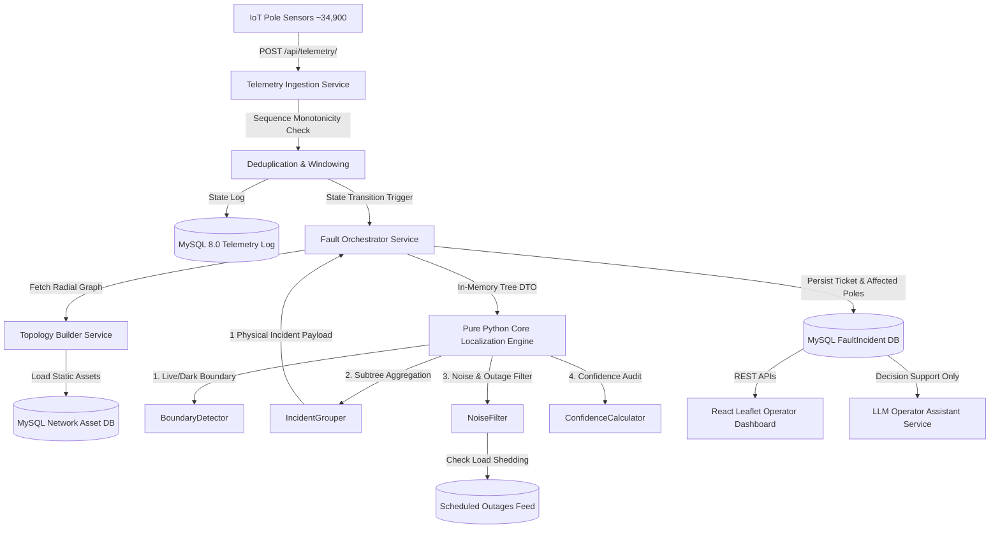

# Architecture & Data System Design

## 1. System Architecture & Data Flow

---

## 2. Ingestion Engine Design
- **Sustained Capacity**: Designed to process $\ge 500 \text{ msg/s}$ steady-state (scaling beyond the subdivision's $39 \text{ msg/s}$ baseline) and tolerate bursts of $5,000 \text{ msgs } / 10\text{s}$ during storm blackouts.
- **Sequence Deduplication**: Enforces strict monotonic sequence number checks per `device_id`. Handles device boot sequence resets (`seq = 0`).
- **Clock Skew & Stale Payload Suppression**: Handles device clock skews ($\pm 90\text{s}$) and discards stale replayed packets older than 6 hours.

---

## 3. Localization Algorithm Details
- **Live/Dark Boundary Edge**: Traverses radial tree downstream from Distribution Transformer. Identifies the exact frontier edge $(P_{\text{last\_live}} \to P_{\text{first\_dark}})$.
- **Subtree Grouping**: Aggregates all dark poles downstream under the boundary edge into **exactly ONE ticket**.
- **Solving the 60% Missing Topology Problem**: For the ~60% of DTs lacking pole ordering (`seq_on_line` and `parent_pole`), the system employs `TopologyInferencer`:
  - Builds Euclidean distance Minimum Spanning Trees (MST) from GPS coordinates ($~4\text{m}$ accuracy) extending outward from the transformer.
  - Explicitly penalizes the diagnostic confidence score (by 20%) and lists inferred topology in the audit trail.

---

## 4. Noise Handling Strategy
- **Dead Sensor Rejection**: If a dark pole has ANY live downstream child pole, electricity is physically flowing through it. The system flags it as a dead sensor / modem drop and emits **zero outage tickets**.
- **Scheduled Outage Suppression**: Dark clusters matching active load-shedding windows (with a 45-minute overrun buffer) are suppressed.
- **FW 1.2 Quiet Fleet**: Tracks missed heartbeat windows ($\ge 20$ mins) for the ~8% fleet on FW 1.2 that send no `power_lost` packets.

---

## 5. API Surface Summary

| Method | Path | Description |
| :--- | :--- | :--- |
| `POST` | `/api/telemetry/` | High-throughput telemetry packet ingestion (HTTP 202) |
| `GET` | `/api/incidents/` | List active fault incidents |
| `GET` | `/api/incidents/{id}/` | Retrieve incident details, timeline, & affected poles |
| `PATCH` | `/api/incidents/{id}/acknowledge/` | Transition status: `detected` $\to$ `acknowledged` |
| `PATCH` | `/api/incidents/{id}/assign/` | Transition status: `acknowledged` $\to$ `crew_assigned` |
| `PATCH` | `/api/incidents/{id}/resolve/` | Transition status: `crew_assigned` $\to$ `resolved` (Triggers telemetry verification) |
| `POST` | `/api/simulator/fault/span` | Inject wire span break |
| `POST` | `/api/simulator/repair/{id}` | Inject restoration telemetry stream |
| `POST` | `/api/ai/incident-summary/{id}` | Generate plain-English operator briefing |

---

## 6. AI Component Justification
- **Where AI is placed**: LLM services (`apps.ai_assistant`) are used **strictly for non-deterministic operator decision support**: generating 2-sentence 2 a.m. briefings, explaining confidence score reasons, and recommending crew equipment.
- **Why AI is NOT used for localization**: Graph traversal on radial trees is deterministic, instant ($< 2\text{ms}$), free, and 100% explainable. An LLM would introduce latency, API cost, and hallucination risk into core electrical safety physics.
