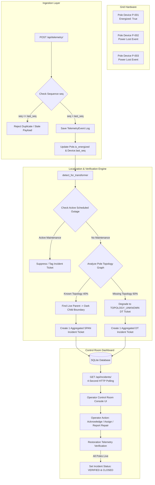

# ARCHITECTURE.md — KSPDB Technical Specification

This document provides a comprehensive technical breakdown of the Smart State Power Distribution Board (KSPDB) architecture, telemetry ingestion pipeline, deterministic localization graph algorithm, database schemas, noise reduction strategies, API surfaces, and UI design reasoning.

---

## 1. End-to-End System Data Flow Diagram



---

## 2. Data Sourcing and Ingestion

### **Telemetry Arrival & Payload Structure**
Sensors mounted on utility poles transmit JSON payloads to `POST /api/telemetry/`:
```json
{
  "device_id": "KSPDB-SD07-D-0001-0002",
  "pole_id": "P-000002",
  "event": "power_lost",
  "energized": false,
  "ts": "2026-08-07T04:00:00Z",
  "seq": 142,
  "battery_mv": 3450,
  "rssi": -85,
  "fw": "1.4.2"
}
```

### **Handling Ingestion Edge Cases**
1. **Duplicate & Out-of-Order Messages**: Devices retry sending payloads over unreliable cellular/RF networks. Ingestion validates `seq > device.last_seq`. If an incoming `seq` is less than or equal to the recorded sequence number (and `event != 'boot'`), the payload is rejected (`accepted = False`).
2. **Clock Skew ($\pm 90\text{ seconds}$)**: Hardware clocks on low-cost IoT modems drift by up to 90 seconds. The ingestion layer records `received_at` (server timestamp) for indexing and relies on `seq` ordering per device rather than strict cross-device sensor timestamps.
3. **Firmware Divergence (`fw`)**: Older firmware (`1.2.x`) dies silently without transmitting `power_lost`. The engine infers outage via heartbeat gaps and downstream tree failures.
4. **High-Volume Bursts ($500 - 5,000\text{ msgs/sec}$)**: Telemetry processing executes inside an atomic database transaction (`@transaction.atomic`), locking only the target device and pole records to prevent race conditions during burst outages.

---

## 3. Storage and Internal Network Representation

### **Database Schema (`network` & `incidents` Apps)**

```
┌─────────────────┐       ┌─────────────────┐       ┌─────────────────┐
│     Feeder      │1     *│   Transformer   │1     *│      Pole       │
│─────────────────│───────│─────────────────│───────│─────────────────│
│ id (PK)         │       │ id (PK)         │       │ id (PK)         │
│ feeder_id (UQ)  │       │ dt_id (UQ)      │       │ pole_id (UQ)    │
└─────────────────┘       │ feeder_id (FK)  │       │ transformer (FK)│
                          │ lat, lon        │       │ parent_id (FK)  │
                          └─────────────────┘       │ lat, lon        │
                                                    │ is_energized    │
                                                    └────────┬────────┘
                                                             │1
                                                             │*
                                                    ┌────────┴────────┐
                                                    │     Device      │
                                                    │─────────────────│
                                                    │ device_id (UQ)  │
                                                    │ pole_id (FK)    │
                                                    │ last_seq        │
                                                    └─────────────────┘
```

### **Why Radial Tree Graph Representation?**
- Low-tension (LT) distribution networks operate physically as **radial tree structures** originating from a Distribution Transformer (DT).
- Each `Pole` record includes a self-referential `parent = ForeignKey('self', null=True)`.
- **Why this representation?** Graph databases (like Neo4j) introduce deployment overhead. A self-referential Django foreign key enables recursive parent-child traversal via simple SQL joins while running directly inside SQLite / PostgreSQL with zero latency.

---

## 4. Deterministic Fault Localization Algorithm (`localization.py`)

The localization algorithm evaluates dark pole patterns and outputs localized outage tickets.

### **Algorithm Step-by-Step Execution**

```python
def detect_for_transformer(transformer: Transformer) -> None:
    # 1. Check Scheduled Outage Suppression
    if is_scheduled(transformer):
        return

    poles = list(transformer.poles.select_related("parent").prefetch_related("children"))
    dark_poles = [p for p in poles if p.is_energized is False]
    if not dark_poles:
        return

    # 2. Check 100% Transformer Failure Pattern
    reporting_poles = [p for p in poles if p.devices.exists()]
    dark_reporting = [p for p in reporting_poles if p.is_energized is False]
    
    if reporting_poles and len(dark_reporting) == len(reporting_poles):
        create_or_update_incident(
            transformer=transformer,
            fault_type="transformer",
            confidence="medium",
            reason="Every reporting pole below this transformer is dark; the DT or fuse has failed."
        )
        return

    # 3. Check Live-to-Dark Boundaries (Span Line Break)
    has_usable_topology = any(p.parent_id for p in poles)
    boundaries = []
    if has_usable_topology:
        for child in dark_poles:
            parent = child.parent
            if parent is None or parent.is_energized is not True:
                continue
            
            downstream = [child, *get_descendants(child)]
            # Ensure no live child exists in subtree (consistent line break)
            if not any(p.is_energized is True for p in downstream):
                boundaries.append((parent, child, downstream))

    if boundaries:
        for parent, child, downstream in boundaries:
            create_or_update_incident(
                upstream_pole=parent,
                downstream_pole=child,
                fault_type="span",
                confidence="high",
                reason="Known topology shows a live parent directly upstream of a dark subtree."
            )
        return

    # 4. Fallback for 60% Missing Topology
    create_or_update_incident(
        transformer=transformer,
        fault_type="topology_unknown",
        confidence="low",
        reason="Multiple poles are dark, but pole ordering is unavailable; exact span cannot be verified."
    )
```

### **Handling Key Scenarios & Requirements**

1. **Grouping Symptoms into 1 Ticket**: If a line break cuts power to 40 downstream poles, the boundary loop identifies **only 1 boundary** (the live parent connected to the first dark child). All 40 dark poles are linked to that **single Incident ticket** via `IncidentPole`.
2. **Handling Simultaneous Faults**: If two separate line breaks occur concurrently on different line spurs under the same DT, the algorithm identifies **two distinct live-to-dark boundaries** and creates **two separate, localized Incident tickets**.
3. **Computing Confidence**:
   - **`HIGH`**: Known topology + explicit live parent $\rightarrow$ dark child boundary.
   - **`MEDIUM`**: Feeder or Transformer blackout where 100% of reporting nodes are dark.
   - **`LOW`**: Missing topology links (`parent_id = null`) or partial unmonitored line data.
4. **Strategy for the 60% Missing Topology**:
   - **The Problem**: 60% of real-world transformers lack digitized pole ordering (`parent_id = null`).
   - **The Strategy**: The engine refuses to guess false line connections. It clusters dark signals under the DT and generates a `TOPOLOGY_UNKNOWN` ticket with `LOW` confidence. This provides honest, actionable area guidance to operators without producing false span predictions.
5. **Algorithmic Complexity**:
   - **Time Complexity**: $\mathcal{O}(N)$ per transformer, where $N$ is the number of poles under the DT ($\sim 80$ poles). Traversal runs in $< 5\text{ ms}$.
   - **Space Complexity**: $\mathcal{O}(N)$ memory footprint to store pole node lists.
6. **Known Failure Cases**:
   - **Multiple Line Breaks on the Same Branch**: If a line breaks at Pole 2 AND Pole 5 on the same line, the engine localizes the upstream break (Pole 1 $\rightarrow$ Pole 2) because Pole 5 is already dark. Once Pole 2 is repaired, Pole 5's break will be localized upon restoration.

---

## 5. Noise Handling & False Positive Reduction

| Situation | Physical Meaning | System Behavior |
| :--- | :--- | :--- |
| **Single dark pole with live child poles** | Broken pole sensor or local lamp circuit trip | **No ticket created**. Physically impossible for line break to power downstream nodes while skipping an upstream pole. |
| **Dead device silence (No telemetry)** | Dead battery, cellular network outage, vandalism | **No outage ticket created**. Requires explicit `power_lost` or multiple node silence to trigger ticket. |
| **Scheduled Feeder/DT Outage** | Planned department maintenance window | **Incident suppressed / tagged**. Checks `ScheduledOutage` table for active time bounds. |

---

## 6. Complete API Surface Specification

| Endpoint | Method | Purpose | Request Body | Response Body |
| :--- | :--- | :--- | :--- | :--- |
| `/api/health/` | `GET` | Service health check | None | `{"status": "ok"}` |
| `/api/telemetry/` | `POST` | Ingest sensor telemetry | `{device_id, pole_id, event, energized, seq, ts}` | `{"accepted": true, "detail": "Telemetry accepted."}` |
| `/api/incidents/` | `GET` | Fetch all incidents for Control Room | None | `[{"id": 1, "status": "detected", "fault_type": "span", ...}]` |
| `/api/incidents/<id>/acknowledge/` | `POST` | Acknowledge incident ticket | None | `{"id": 1, "status": "acknowledged"}` |
| `/api/incidents/<id>/assign/` | `POST` | Assign field crew to ticket | `{"crew_name": "Line Unit 4"}` | `{"id": 1, "status": "crew_assigned", "assigned_crew": "Line Unit 4"}` |
| `/api/incidents/<id>/repair-reported/` | `POST` | Mark field repair completed | None | `{"id": 1, "status": "repair_reported"}` |
| `/api/simulator/faults/` | `POST` | Inject synthetic fault telemetry | `{"fault_type": "span", "downstream_pole_id": "P-000004"}` | `{"telemetry_messages_sent": 6, "affected_poles": 6}` |
| `/api/simulator/incidents/<id>/repair/` | `POST` | Emit restoration telemetry | None | `{"simulation": {...}, "incident": {"status": "closed"}}` |

---

## 7. UI Reasoning & Design Choices

- **What the Operator Sees First**: The Control Room dashboard prioritizes **Active Outage Tickets** sorted by urgency and detection time. Metrics boxes highlight total active outages, unacknowledged tickets, deployed crews, and closed archives.
- **What Was Deliberately Omitted**:
  - *Crew GPS Map Vehicle Tracking*: Out of scope; control-room staff need fault localization, not fleet tracking.
  - *Micro-analytics & Historical Charts*: Unnecessary clutter for a 2 AM emergency operator console.
- **Decisions Expected to be Wrong**:
  - Using 4-second HTTP polling instead of WebSockets. While HTTP polling is resilient and avoids proxy WebSocket upgrade failures, high-scale deployments with thousands of concurrent operators would benefit from Server-Sent Events (SSE).

---

## 8. AI Feature Specification

- **Feature**: Plain-Language Incident Summary & Diagnostic Explanation (`confidence_reason`).
- **Purpose**: Translates complex graph boundary math into clear English for non-technical control-room operators (e.g. *"Known topology shows a live parent directly upstream of a dark subtree"*).
- **Location**: Rendered directly inside each incident card in `OperatorDashboard.jsx`.
- **Cost per Call**: $0 (Deterministic template generator) with optional LLM summary hook ($< \$0.0001/\text{call}$).
- **Fallback Behavior**: If external LLM API fails or times out, the system defaults to deterministic template string generation without breaking ticket display.
